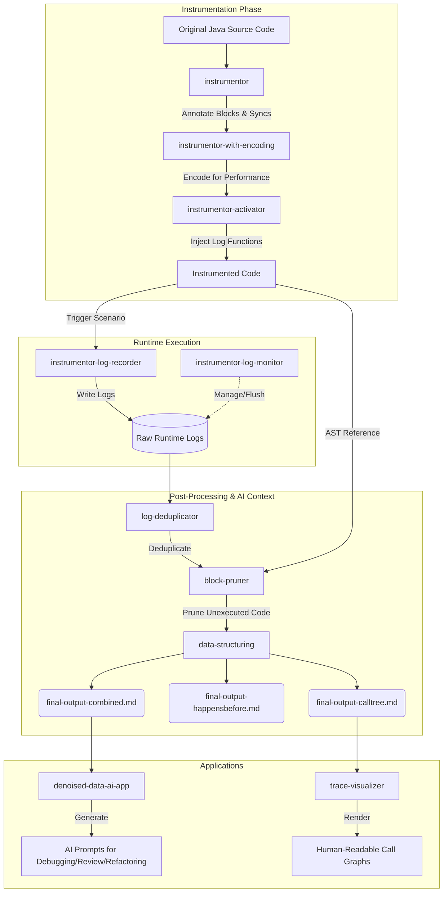

# Scenario-Driven Code Context Generator for AI

This project is an advanced instrumentation and log-processing framework designed to generate **zero-noise, scenario-specific, and multithread-aware code context** for Large Language Models (LLMs). 

By shifting the paradigm from "global static analysis" to "scenario-based runtime facts," this toolchain captures the exact execution paths and inter-thread synchronization dependencies triggered by a specific stimulus. It then prunes unexecuted code and structures the runtime data into highly focused prompts. This bridges the gap between complex multithreaded system behaviors and the sequential reasoning capabilities of AI.

## 🏗️ Architecture & Workflow

The pipeline consists of three main phases: **Instrumentation (Compile-time)**, **Execution (Runtime)**, and **Post-Processing (Analysis)**.

## 📂 Project Structure & Modules

The repository is divided into several specialized modules:

### 1. Instrumentation Tools (Code Prep)
*   **`instrumentor`**: The initial AST processor. It adds comments to every basic block (recording the file and line number) and instruments all inter-thread synchronization mechanisms (locks, volatiles, latches, etc.).
*   **`instrumentor-with-encoding`**: Optimizes the instrumentation by mapping the file/line number comments to unique integer encodings. This drastically reduces the performance overhead of the logging payload.
*   **`instrumentor-activator`**: The final step of code preparation. It replaces the encoded block comments with actual logging function calls, passing the block ID as an argument.

### 2. Runtime Components (Data Collection)
*   **`instrumentor-log-recorder`**: The actual runtime logging implementation injected into the source code. It records block executions and synchronization events with minimal latency.
*   **`instrumentor-log-monitor`**: A daemon thread that starts automatically upon the first log invocation. It provides an interface to query, flush, and clear the scenario logs once the target stimulus has been fully processed.

### 3. Data Processing (Noise Reduction)
*   **`log-deduplicator`**: Processes the raw runtime logs to perform inter-thread level deduplication, ensuring the data remains compact without losing causal links.
*   **`block-pruner`**: Analyzes the deduplicated logs on a per-thread basis. It takes the original AST and **empties (prunes) all basic blocks that were not executed** during the scenario, leaving only the exact code paths that were triggered.
*   **`data-structuring`**: Transforms the pruned code and synchronization logs into structured, AI-friendly Markdown files (`final-output-calltree.md`, `final-output-happensbefore.md`, and `final-output-combined.md`).

### 4. Application Layer (AI & Human Interfaces)
*   **`denoised-data-ai-app`**: A utility that consumes the `final-output-combined.md` data to generate highly targeted AI prompt templates. These templates can be used for:
    *   **Secondary Development & Refactoring:** Expanding from core scenarios to progressive construction. 
    *   **Code Review & Anomaly Diagnosis:** Performing factual auditing based on zero-noise runtime evidence.
*   **`trace-visualizer`**: A helper tool designed for human developers. It visualizes the function call relationships from the logs, making it easier for humans to grasp the execution flow alongside the AI.

## 🚀 Output Examples

The pipeline ultimately generates a set of noise-free data files representing the exact scenario:

*   **`final-output-calltree.md`**: Contains the hierarchical execution flow for each thread, including the exact sequence of executed block IDs and the heavily pruned source code (only showing what actually ran).
*   **`final-output-happensbefore.md`**: Details the synchronization edges (`Happens-Before` rules), data races, and potential inter/intra-thread taint flows.
*   **`final-output-combined.md`**: The ultimate synthesis of the call tree and happens-before data. This is the perfect, zero-noise context payload for an LLM.